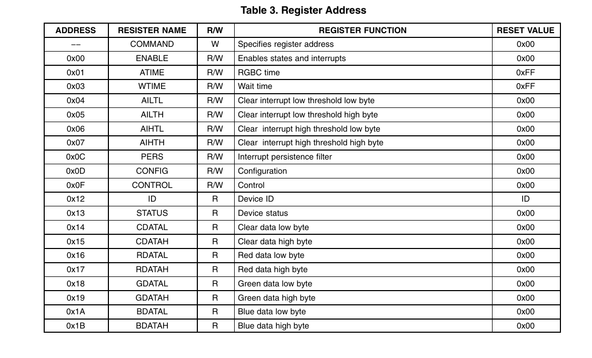
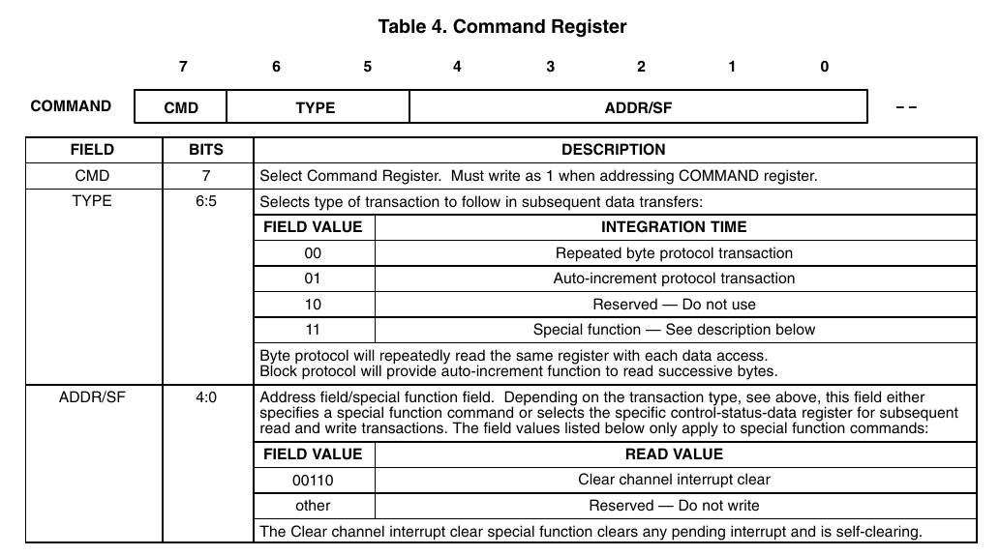
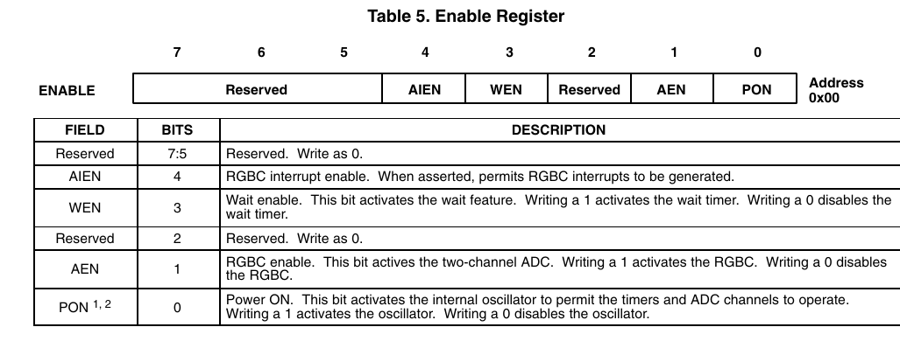
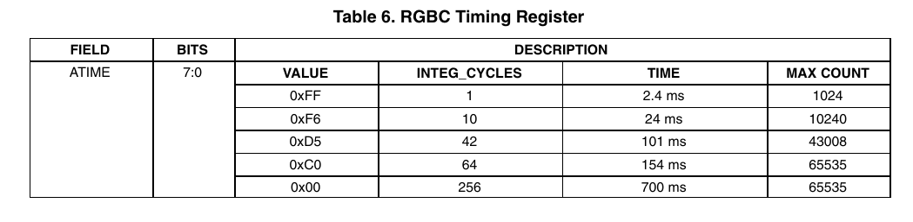
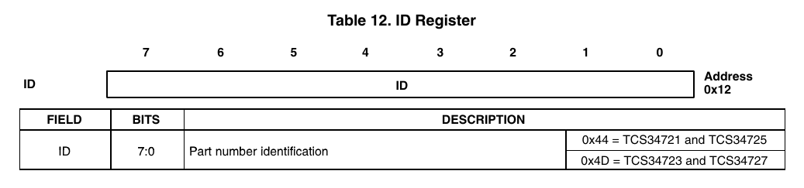
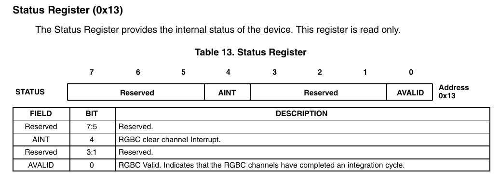

**[4/5/2020]** Bu günlükteki ilk girdi olduğundan, biraz girizgah yapmak gerekir.

# Girizgah
Bu proje fikri, çekmecelerimi karıştırırken önüme bir renk sesnörü ve toz toplamaktan başka bir iş görmeyen bir Raspberry Pi 3 çıkmasıyla oluştu.
Hem son gelişmelerle elime geçen boş zamanı iyi kullanmak, hem de sınav sürecinde paslanmamak için böyle bir projeye giriştim.
Proje sürecinde ihtiyacım olan bilgileri bir yerde toplamak için de böyle bir günlük tutmaya karar verdim.

# Proje parçaları
Proje 3 kısımdan oluşmaktadır

1. Renk sensörü sürücü yazılımı
- I2C yordamıyla sensörden alınan renk verilerinin 16'lık biçemde bir cihaz dosyasına (/var/colorRGB) #RRGGBB şeklinde yazacak bir C programı

2. Web sunucusu
- 1. programdan alınan renk verilerini WebSockets üzerinden istemcilere aktaracak
- HTTP bağlantısıyla istemcilere 3. programı (web sitesini) gönder
- Bu aşamada program için flask kullanılması düşünülmektedir

3. Web sitesi
- Sitenin ortasında renkli bir kare ile algılanan renk gösterilecektir.
- Ayrıca Rpi'den çekilen renk metin olarak da gösterilecektir.
- İstemci tarafında çalışan JS ile her renk güncellendiğinde site dinamik olarak değişecektir.

4. İstemci programı
- QWebSockets kullanılarak C++ dilinde yazılacaktır.
- 3. programla benzer bir arayüzü olacaktır.
- İstenen renklerden biri algılanınca belirtilen programlar açılacaktır (örn. turuncu -> firefox)

**[6/5/2020]** Bugün TCS34725 renk sensörünün bilgi kitapçığını (datasheet) inceleyerek sensörden veri almak için strateji geliştireceğim.

# TCS34725 Başlıca Veri Adresleri

Bu entegrede normalden farklı olarak bir adrese erişmek için register adresi değil, komut kodu yazılmaktadır.

## COMMAND (adres yok)


- Komut kodunun 7. bitinin her zaman 1 olması gerekir.

- Altıncı ve 5. bitler ise register erişimi ile ilgilidir.
	Biz otomatik arttırma kullanmayacağımız için bu bitleri 0 olarak bırakacağız.

- Geri kalan 5 bite işe erişmek istediğimiz adresi yazacağız.

**Özet:** Okuma ve yazma rutinlerinde erişilecek adrese 0x80 eklenecektir.

## ENABLE (0x00)


- 7,6,5 ve 2. bitler ayrılmış (rezerve) olup bunlara 0 yazılması gerekmektedir.

- Dördüncü bit RGBC kesmesini, 3. bit ise bekleme özelliğini etkinleştirmektedir.
	Bu proje için bunları kullanmaya gerek olmadığından bunlara 0 yazılacaktır.

- Birinci bit analog-sayısal dönüştürücüyü etkinleşterek renk değerlerini almamızı sağlar.

- Sıfırıncı bit ise entegrenin saat palsini etkinleştirerek ADC'ye güç verir.

**Özet:** Bu adrese program başında 0x3 (0b00000011) yazılacaktır.

## ATIME (0x01)


Bu register ile döngü periyotları ile oynanabilir.
Döngü periyotu arttırılırdıkça hassaslık artar, fakat algılayıcıdan gelen veri sıklığı azalır.
Bize 64 saykıl yeterli olacaktır.

**Özet:** Bu adrese program başında 0xC0 yazılacaktır.

## ID (0x12)


Buradaki değer okunarak sensörün bağlantısı ve model numarası tespit edilebilmektedir.

**Özet:** Başlangıç rutininden sonra bu adresten 0x44 değeri okunması gerekmektedir.

## STATUS (0x13)


Burada bizi ilgilendiren 0. bittir.
Bu bitin 1 olması durumunda sensör okunmaya hazırdır.

## RENK VERİLERİ (0x14 - 0x1B)


Okunan her renk değeri sensör hafızasında kanal başına 16-bit şeklinde depolanır.

**Not:** Renk kanalları okunacakken 16-bitlik (2 kelimelik) bir okuma rutini kullanılmalıdır ki yüksek bitler mühürlensin.

**[9/5/2020]** Bugün sensör ile haberleşmeyi ve renk algılama rutinlerini denemek için ufak bir program yazdım.

```c
#include <errno.h>
#include <wiringPiI2C.h>
#include <stdio.h>
#include <time.h>
#include <stdint.h>
#include "tcs34725.h"


int main (void)
{
	int fd;
	uint8_t id, red, grn, blu; 		/* normalleştirilmiş RGB değerleri*/ 
	uint16_t r_raw, g_raw, b_raw, c_raw; 	/* sensörden gelen saf değerler */
	uint32_t toplam; 			/* normalleştirme algoritması için gerekli */

	struct timespec integration_time; 	/* Gerekli bekleme süresi */
	integration_time.tv_sec = 0;
	integration_time.tv_nsec = INT_TIME; 	/* 101 ms */

	fd = wiringPiI2CSetup (SLAVE_ID);
	if (fd == -1)
	{
		printf ("wiringPiI2CSetup hata, errno: %d\n", errno);
		return (-1);
	}

	id = wiringPiI2CReadReg8 (fd, REG_ID); /* baglanti kontrolu */
	if (id != ID_VAL)
	{
		printf ("I2C baglanti hatasi!\n Okunan ID: %x\n", id);
		return (-1);
	}
	/* baslangic rutini */
	wiringPiI2CWriteReg8 (fd, REG_ATIME, ATIME_VAL);
	wiringPiI2CWriteReg8 (fd, REG_EN, (AEN_MASK | PON_MASK));

	/* renk okuma */
	for(;;)
	{
		nanosleep(&integration_time, NULL);
		c_raw = (uint16_t) (wiringPiI2CReadReg16 (fd, REG_CDATAL));
		r_raw = (uint16_t) (wiringPiI2CReadReg16 (fd, REG_RDATAL));
		g_raw = (uint16_t) (wiringPiI2CReadReg16 (fd, REG_GDATAL));
		b_raw = (uint16_t) (wiringPiI2CReadReg16 (fd, REG_BDATAL));
		
		/* Normalleştirme algoritması */
		toplam = c_raw;
		if (toplam == 0)
			red = grn = blu = 0;	/* Eğer clear 0 ise siyah renk döndür */
		
		red = (uint8_t) ((float)r_raw / toplam * 255.0);
		grn = (uint8_t) ((float)g_raw / toplam * 255.0);
		blu = (uint8_t) ((float)b_raw / toplam * 255.0);

		printf ("Renk: #%02X%02X%02X\n", red, grn, blu);
	}
	return (0);
}
```
Bu programda üzerinde durmak istediğim iki kısım var:

```c
#include <time.h>
...
struct timespec integration_time; 	/* Gerekli bekleme süresi */
integration_time.tv_sec = 0;
integration_time.tv_nsec = INT_TIME; 	/* 101 ms */
...
nanosleep(&integration_time, NULL);
```
Değer okumalar arasında 101ms zaman aralığı olduğu için normal **sleep()** komutu yeteri hassasiyet sunmadığından [nanosleep()](https://pubs.opengroup.org/onlinepubs/9699919799/functions/nanosleep.html "nanosleep kılavuz sayfası") sistem çağrısını kullanmam gerekti. Bu yüzden time.h'ı çektim ve bir timespec yapısı oluşturmam gerekti. (Not: nanosleep yalnıx UNIX-benzeri sistemlerde bulunmaktadır.)

```c
uint32_t toplam;
...
/* Normalleştirme algoritması */
toplam = c_raw;
if (toplam == 0)
	red = grn = blu = 0;	/* Eğer clear 0 ise siyah renk döndür */

red = (uint8_t) ((float)r_raw / toplam * 255.0);
grn = (uint8_t) ((float)g_raw / toplam * 255.0);
blu = (uint8_t) ((float)b_raw / toplam * 255.0);

printf ("Renk: #%02X%02X%02X\n", red, grn, blu);
```
Yukarıdaki kod parçasında ise sensörden aldığımız 16-bitlik saf renk verisi CLEAR değerine bölünerek normalleştiriliyor. Daha sonra aynı değer 255'e bölünerek 8 bite sığdırılabilir hale getiriliyor.  
Bu normalleştirme algoritması, [Adafruit'in Arduino için yazdığı TCS34725 sürücüsü](https://github.com/adafruit/Adafruit_TCS34725)nün normalleştirme algoritmasının modifiye edilmiş halidir. 

Programın geri kalan kısmında açıklamaya gerek duyulmadığını düşünüyorum.

Programı derlemek için Raspberry Pi üzerinde:
```  
gcc -lwiringPi i2c_prototype.c
```
girilmesi lazımdır.

[13/05/2020] Bugün sensöre erişmek ve sensörü çalıştırmak için gerekli olan kodu ayrı fonksiyonlara aldım ve derlemeyi kolaylaştırmak için bir Makefile oluşturdum. 

[24/05/2020] Bugün sonunda asıl sürücü programını yazabildim. Fakat şu an RPi bilgisayara bağlanmadığı için kodu ssh üzerinden deneyemiyorum. Sorun çözüldükten sonra kodu debeyerek eğer çalışırsa bu projenin 1. faslını noktalayacağım.
