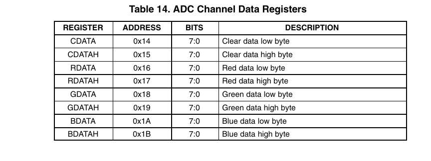

**[4/5/2020]** Bu günlükteki ilk girdi olduğundan, biraz girizgah yapmak gerekir.

# Girizgah
Bu proje fikri, çekmecelerimi karıştırırken önüme bir renk sesnörü ve toz toplamaktan başka bir iş görmeyen bir Raspberry Pi 3 çıkmasıyla oluştu.
Hem son gelişmelerle elime geçen boş zamanı iyi kullanmak, hem de sınav sürecinde paslanmamak için böyle bir projeye giriştim.
Proje sürecinde ihtiyacım olan bilgileri bir yerde toplamak için de böyle bir günlük tutmaya karar verdim.

# Proje parçaları
Proje 3 kısımdan oluşmaktadır

1. Renk sensörü sürücü yazılımı
- I2C yordamıyla sensörden alınan renk verilerinin 16'lık biçemde bir cihaz dosyasına (/var/colorRGB) #RRGGBB şeklinde yazacak bir C programı

2. Web sunucusu
- 1. programdan alınan renk verilerini WebSockets üzerinden istemcilere aktaracak
- HTTP bağlantısıyla istemcilere 3. programı (web sitesini) gönder
- Bu aşamada program için flask kullanılması düşünülmektedir

3. Web sitesi
- Sitenin ortasında renkli bir kare ile algılanan renk gösterilecektir.
- Ayrıca Rpi'den çekilen renk metin olarak da gösterilecektir.
- İstemci tarafında çalışan JS ile her renk güncellendiğinde site dinamik olarak değişecektir.

4. İstemci programı
- QWebSockets kullanılarak C++ dilinde yazılacaktır.
- 3. programla benzer bir arayüzü olacaktır.
- İstenen renklerden biri algılanınca belirtilen programlar açılacaktır (örn. turuncu -> firefox)

**[6/5/2020]** Bugün TCS34725 renk sensörünün bilgi kitapçığını (datasheet) inceleyerek sensörden veri almak için strateji geliştireceğim.

# TCS34725 Başlıca Veri Adresleri

Bu entegrede normalden farklı olarak bir adrese erişmek için register adresi değil, komut kodu yazılmaktadır.

## COMMAND (adres yok)

- Komut kodunun 7. bitinin her zaman 1 olması gerekir.

- Altıncı ve 5. bitler ise register erişimi ile ilgilidir.
	Biz otomatik arttırma kullanmayacağımız için bu bitleri 0 olarak bırakacağız.

- Geri kalan 5 bite işe erişmek istediğimiz adresi yazacağız.

**Özet:** Okuma ve yazma rutinlerinde erişilecek adrese 0x80 eklenecektir.

## ENABLE (0x00)

- 7,6,5 ve 2. bitler ayrılmış (rezerve) olup bunlara 0 yazılması gerekmektedir.

- Dördüncü bit RGBC kesmesini, 3. bit ise bekleme özelliğini etkinleştirmektedir.
	Bu proje için bunları kullanmaya gerek olmadığından bunlara 0 yazılacaktır.

- Birinci bit analog-sayısal dönüştürücüyü etkinleşterek renk değerlerini almamızı sağlar.

- Sıfırıncı bit ise entegrenin saat palsini etkinleştirerek ADC'ye güç verir.

**Özet:** Bu adrese program başında 0x3 (0b00000011) yazılacaktır.

## ATIME (0x01)

Bu register ile döngü periyotları ile oynanabilir.
Döngü periyotu arttırılırdıkça hassaslık artar, fakat algılayıcıdan gelen veri sıklığı azalır.
Bize 64 saykıl yeterli olacaktır.

**Özet:** Bu adrese program başında 0xC0 yazılacaktır.

## ID (0x12)

Buradaki değer okunarak sensörün bağlantısı ve model numarası tespit edilebilmektedir.

**Özet:** Başlangıç rutininden sonra bu adresten 0x44 değeri okunması gerekmektedir.

## STATUS (0x13)

Burada bizi ilgilendiren 0. bittir.
Bu bitin 1 olması durumunda sensör okunmaya hazırdır.

## RENK VERİLERİ (0x14 - 0x1B)

Okunan her renk değeri sensör hafızasında kanal başına 16-bit şeklinde depolanır.

**Not:** Renk kanalları okunacakken 16-bitlik (2 kelimelik) bir okuma rutini kullanılmalıdır ki yüksek bitler mühürlensin.
